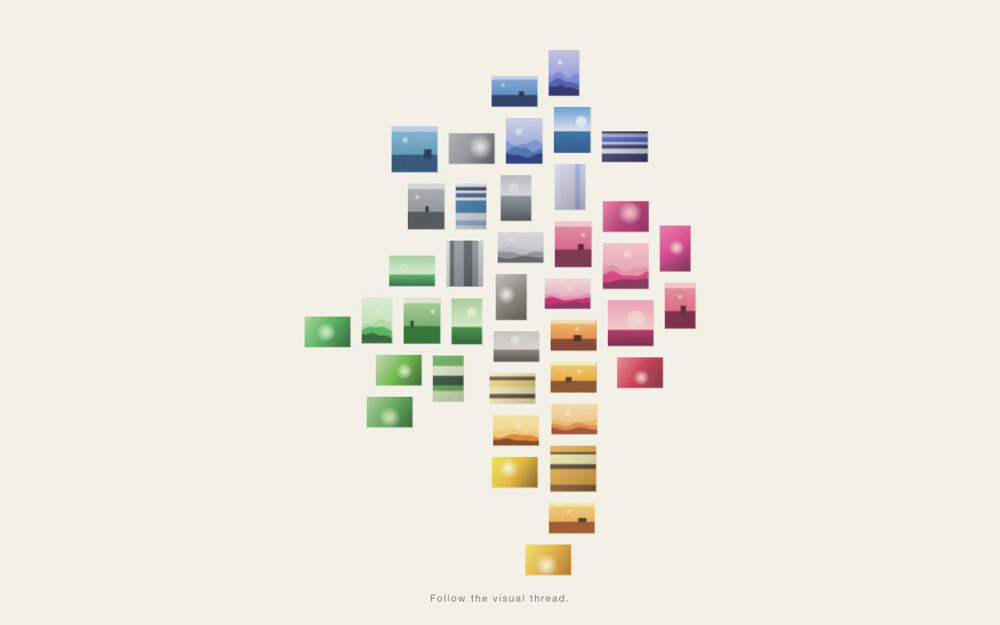
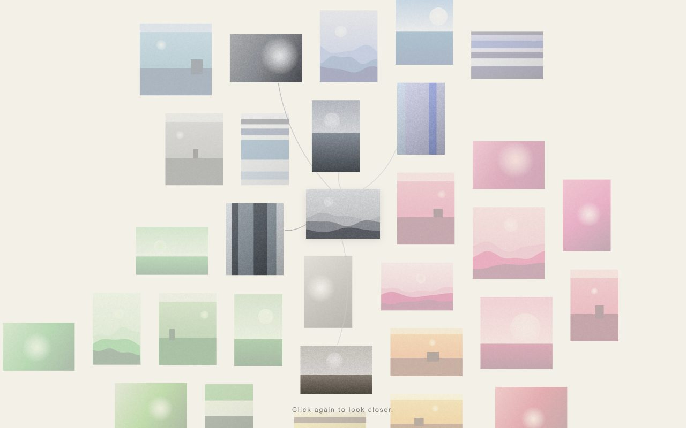
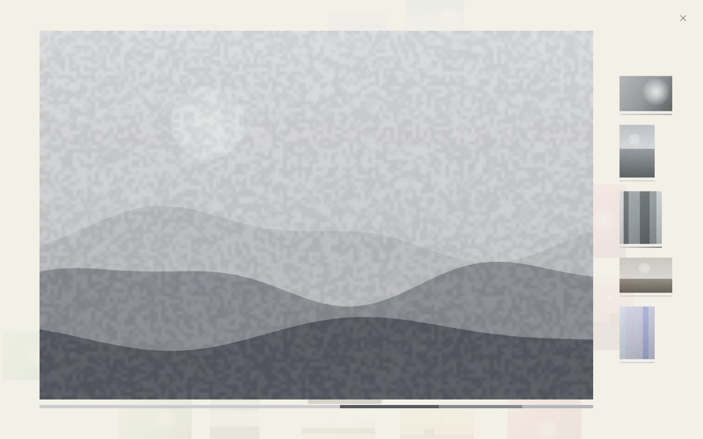
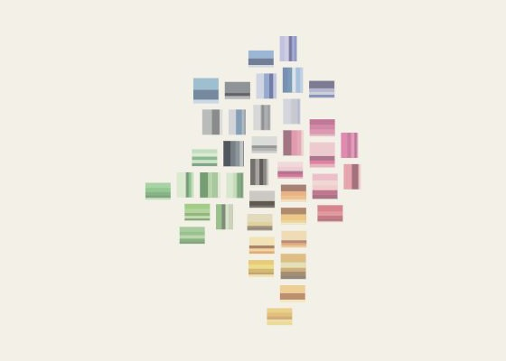
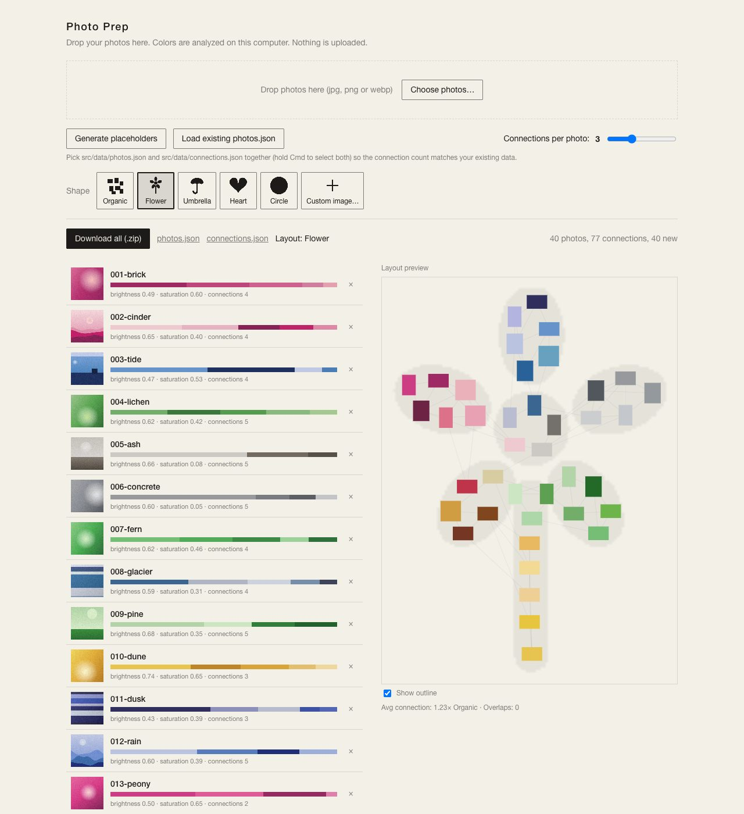

# Visual Threads

Explore a photo collection by **visual continuity** instead of albums, dates or grids. Photos connect to each other through shared color, and you follow a "thread" from one image to the next across a spatial canvas.



*Screenshots in this README use generated placeholder images.*

- **Static site.** React + Vite + TypeScript. No backend, no accounts, no network calls.
- **Analysis happens once, on your computer.** A small tool called **Photo Prep** reads your photos, finds colors and connections, and writes two JSON files. The site only reads those files.

## Quick start

You need [Node.js](https://nodejs.org) 18 or newer and Chrome.

```
npm install
npm run dev
```

- The site: http://localhost:5173/
- Photo Prep: http://localhost:5173/prep.html (only available while `npm run dev` is running)

The project ships with 40 placeholder photos so it works right away.

## Using the site

| Do this | To |
|---|---|
| Hover a photo | See its strongest connections |
| Click a photo or a connection | Follow the thread: the camera moves there and shows that photo's connections |
| Click the focused photo again (tap on a phone) | Look closer |
| Drag, scroll, or pinch | Pan and zoom |
| Zoom out | Photos turn into color cards, showing the whole collection as a landscape of color |
| **Esc** | Go back (close the close-up, then leave focus) |
| **Tab** / **Enter** | Move between the focused photo's neighbors / follow or open |



**Look closer.** Click the focused photo again to see it large. The strip on the right shows its connected photos: click one to keep following the thread. Press Esc, click the ×, or click anywhere else to return to the graph.



**Zoomed out.** Every photo becomes its color palette.



## Add your own photos

Photo Prep turns your photos into the files the site needs. Everything runs in your browser and nothing is uploaded. Your originals stay on your computer and are never added to the project; only resized WebP copies are.



1. Run `npm run dev` and open http://localhost:5173/prep.html in **Chrome**.
2. Choose one:
   - **Starting fresh** (replacing the placeholders): delete everything in `public/photos/` first.
   - **Adding to an existing collection:** click **Load existing photos.json** and select both `src/data/photos.json` and `src/data/connections.json` (hold Cmd or Ctrl to pick two). This keeps your current photos and makes Prep match your existing connection count.
3. Drop your photos on the page (JPG, PNG or WebP). iPhone HEIC files aren't supported: export them as JPEG first.
4. Optionally pick a **shape** (see below) and check that the label next to Download says what you expect.
5. Click **Download all (.zip)**.
6. **Save your current work first** (commit, or copy `src/data/`): unzipping overwrites `src/data/photos.json` and `connections.json`.
7. Unzip into the project folder, merging into what's there. On macOS or Linux, from the project folder:
   ```
   unzip -o ~/Downloads/"visual-threads-photos.zip"
   ```
   Don't drag the unzipped `public` and `src` folders onto the project in a file manager: that *replaces* the folders and deletes your existing photos.
8. Check the site with `npm run dev`, then commit.

**Good to know**
- Adding photos recalculates the whole arrangement, so existing photos may move. Photo ids and image files stay the same.
- Prep remembers your shape and "Connections per photo" in that browser only.
- Optional: add `"alt": "short description"` to a photo in `src/data/photos.json` for screen readers. Prep keeps it when you re-export.
- More detail, including removing a photo, is in [CLAUDE.md](CLAUDE.md).

### Shapes

By default photos are arranged organically by color. In Photo Prep you can instead arrange the whole collection into a **flower**, **umbrella**, **heart**, **circle**, or any silhouette you upload (**Custom image**: a bold, filled shape, dark on light or on a transparent background; tick *Invert* if it's light on dark). Similar photos stay close to each other inside the shape, and the connections don't change, only where photos sit. Shapes work best with roughly 30 to 100 photos.

## Publish

```
npm run build
```

Upload the `dist/` folder to any static host. Photo Prep is not included in the build. Everything in `public/` is published, so remove any test or example folders from it first. If the site lives in a sub-folder (for example GitHub Pages at `/repo-name/`), set `base: '/repo-name/'` in `vite.config.ts` before building.

To preview the built site locally: `npm run preview`.

## Project layout

```
src/site/       the website: canvas, camera, close-up view
src/prep/       Photo Prep (development only)
src/analysis/   color analysis, connections, layouts and shapes (used by Photo Prep only)
src/data/       photos.json and connections.json, written by Photo Prep and read by the site
public/photos/  resized images
docs/           design spec (visual-threads-plan.md) and design notes (design-notes.md)
```

Other commands: `npm run typecheck`.

## License

[MIT](LICENSE)
